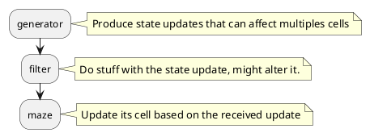

# ccmaze

## Installation

On your computercraft, fetch the ccmaze downloader tool :

```shell
wget https://raw.githubusercontent.com/smallcluster/ccmaze/refs/heads/master/ccmaze-dl.lua
```

And run it to install the library in the current working directory :

```shell
./ccmaze-dl
```

### Demo

The `ccmaze-dl` will also download a demo file. To run it, simply put an advanced monitor next your advanced computer and run `ccmaze-demo`. 


## Available generators

- Recursive-Backtracking
- Kruskal
- Origin shift

## Architecture



