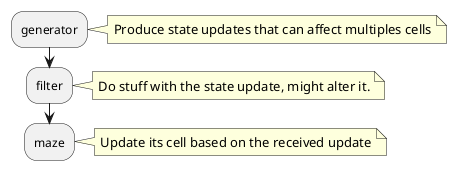

# ccmaze

## Installation

The ccmaze library exist in two different forms :

- The original modularized code
- The minified code

### Minimized version

It's the easiest one to get up and running, this will download the latest version of **ccmaze** :

```shell
wget https://raw.githubusercontent.com/smallcluster/ccmaze/refs/heads/master/ccmaze.lua
```

### Modular version


On your computercraft, fetch the ccmaze downloader tool :

```shell
wget https://raw.githubusercontent.com/smallcluster/ccmaze/refs/heads/master/ccmaze-dl.lua
```

### Demo

```shell
wget https://raw.githubusercontent.com/smallcluster/ccmaze/refs/heads/master/ccmaze-demo.lua
```


## Available generators

- Recursive-Backtracking
- Kruskal
- Origin shift

## Architecture



